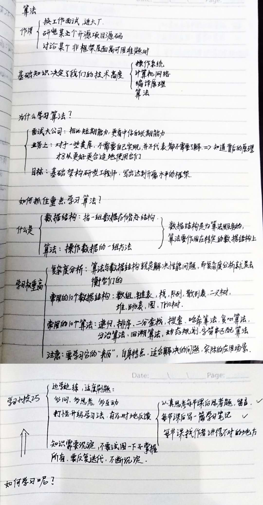
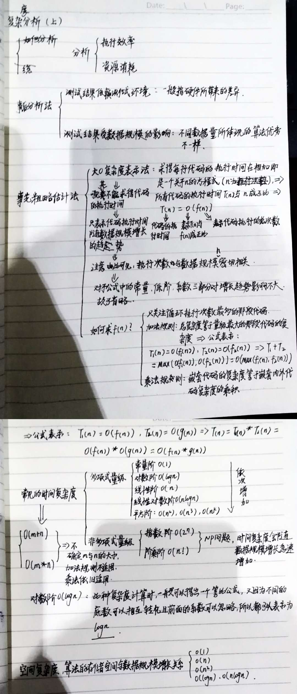
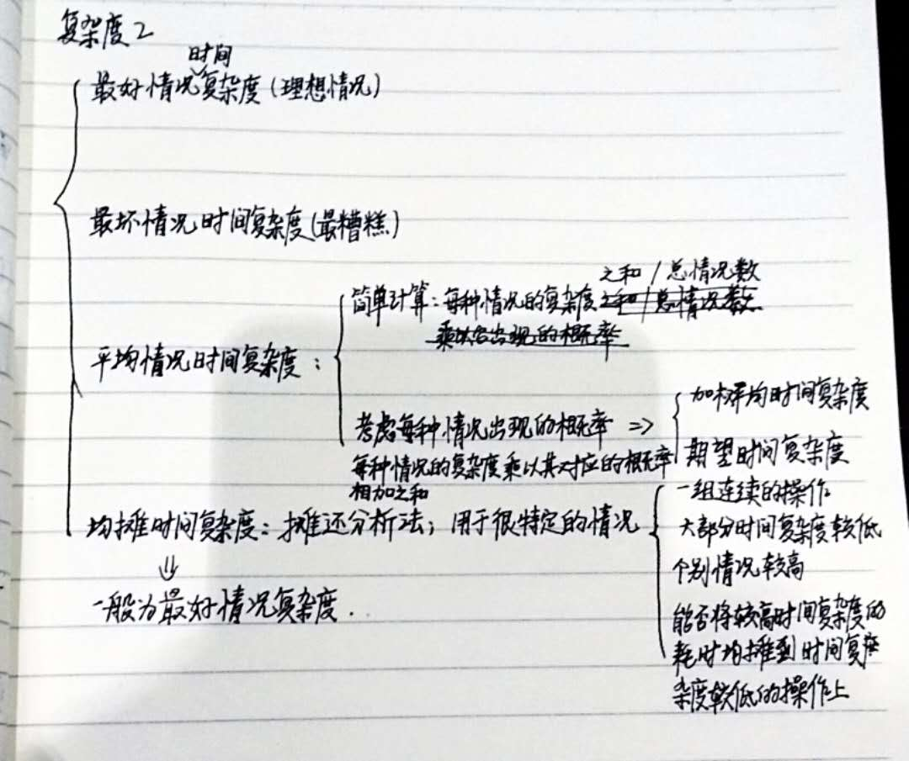

### 算法

> 一个永远向往的梦，一个永远没有自信的痛，一个不断尝试的我。
> 本算法学习是根据**极客时间**的**数据结构与算法之美**专栏，有人带总比蒙头干强啊！

#### 笔记

##### 了解算法的what、why、how



##### 复杂度的分析





###### 例题

```C
// n表示数组array的长度
int find(int[] array, int n, int x) {
  int i = 0;
  int pos = -1;
  for (; i < n; ++i) {
    if (array[i] == x) {
      pos = i;
      break;
    };
  }
  return pos;
}
```
1. 当传入的`x`整好与数组的一个元素相等，则时间复杂度为`O(1)`，即**最好时间复杂度**；
2. 当与数组最后一个元素相等时，时间复杂度为`O(n)`，即**最坏时间复杂度**；
3. 因为`x`的值没法确定，但是肯定在数组中和不在数组中，则有`n+1`种情况，这时可以粗略地算出其**平均复杂度**为：`(1+2+3+...+n+n)/(n+1) = [n(n+3)]/[2(n+1)] = O(n)`；如果考虑每个情况出现的概率则不一样，首先出现在数组中和不在数组中各占`1/2`，若在数组中则每个值又各占`1/n`，所以数组中每个值平均出现的概率是`1/(2n)`，不在数组中的值概率为`1/2`。这时的平均时间复杂度又叫做**加权平均时间复杂度**或**期望时间复杂度**为：`(1+2+3+...+n)*[1/(2n)]+n*(1/2) = (3n+1)/4 = O(n)`。

```C
 // array表示一个长度为n的数组
 // 代码中的array.length就等于n
 int[] array = new int[n];
 int count = 0;
 
 void insert(int val) {
    if (count == array.length) {
       int sum = 0;
       for (int i = 0; i < array.length; ++i) {
          sum = sum + array[i];
       }
       array[0] = sum;
       count = 1;
    }

    array[count] = val;
    ++count;
 }
```
1. 其最好时间复杂度为：`O(1)`；
2. 其最坏时间复杂度是当`count==array.length`时，为：`O(n)`；
3. 其平均时间复杂度，首先`count`的情况为`0...n`即`n+1`种，每种出现的概率为`1/(n+1)`，又因前`n`种的时间复杂度均为`O(1)`，最后一种为`O(n)`，所以为：`(1*n+n)*[1/(n+1)] = (2n)/(n+1) = O(1)`
4. 此题还可以使用**均摊时间复杂度**来衡量，即把`O(n)`的复杂度均摊到`n-1`次上，平均也是`O(1)`，所以为：`O(1)`

```C
// 全局变量，大小为10的数组array，长度len，下标i。
int array[] = new int[10]; 
int len = 10;
int i = 0;

// 往数组中添加一个元素
void add(int element) {
   if (i >= len) { // 数组空间不够了
     // 重新申请一个2倍大小的数组空间
     int new_array[] = new int[len*2];
     // 把原来array数组中的数据依次copy到new_array
     for (int j = 0; j < len; ++j) {
       new_array[j] = array[j];
     }
     // new_array复制给array，array现在大小就是2倍len了
     array = new_array;
     len = 2 * len;
   }
   // 将element放到下标为i的位置，下标i加一
   array[i] = element;
   ++i;
}
```
> 此题中虽然没有`n`这个不确定量，但是注意每次`len`都以两倍的值增长，同样是个不确定量，可以看着`n`

1. 最好时间复杂度为：`O(1)`；
2. 最坏时间复杂度，其实和当时`len`的长度有关，依次为`O(1*n)、O(2*n)、O(2*2*n)...O(2^(n-1)*n)`，可以发现每次都为：`O(n)`；
3. 平均时间复杂度，因为每次循环后`i`变量并没有被重置，所以依次循环所取得的情况为`0~len、len+1~len*2...`，可知每次`i`取得一个数的概率为`1/(len+1)`，又因前`n`次复杂度均为`O(1)`，`i>=len`时复杂度为`O(n)`，所以平均时间复杂度为：`(n+n)*[1/(len+1)] = 2n/[1/(n+1)] = O(1)`；
4. 均摊时间复杂度与上题一样

