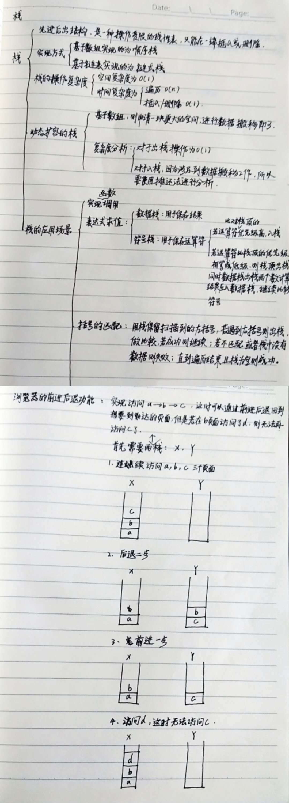

##### 栈

1. **逻辑结构** 栈是一种先进后出的线性表,分成栈底和栈顶. 注意进出都是从栈顶开始的.

2. **存储结构** 分为顺序存储和链式存储, 都是利用线性表实现的.
   > 顺序存储:   
    1. 使用数组实现。只需要一个指针top(top指针只是使用下标来代替), 因为进出都在栈顶. 初始化时, 指针是并不是指向数组的第一个元素的, 即为top = -1. 那么具体的入栈和出栈过程是怎样的呢?  
    2. 入栈。先移动top指针，再入栈元素。很合理，因为是用数组实现的，而且初始top并不指向数组，所以只能先指向数组，才能加入元素。 
    出栈。先出栈元素，再移动栈顶指针top。这里需要注意，这时只是指针指向变了，但其实元素还是在数组中的。
    3. 栈满和栈空。当top = -1时为栈空；当top = maxSize - 1为满。
    
    > 链式存储：
    1. 使用结构体实现。每个结构体分为两块，一块是存储数据，一块是存储指针。这时会有一个额外的空间，称为头指针head，它存储数据的块是空的，但是存储指针的块一直指向栈顶。
    2. 入栈，申请一个新的空间，将head所存储的指针赋值给新空间的存储指针块，再将新空间的指针赋值给head存储指针块。  
       出栈，将head所存指针指向的空间的所存指针赋值给head存储指针块即可。很绕是不是，但是很好理解。  
       可以发现，入栈和出栈都是从head开始或者说是从栈顶开始的。另外说一下，栈底空间的存储指针块指向null。
    3. 栈满和栈空。只要内存有空间，栈满无界限；栈空，当然是head存储指针块指向null了。