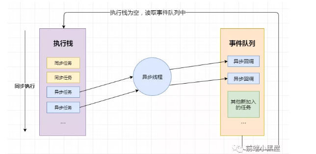
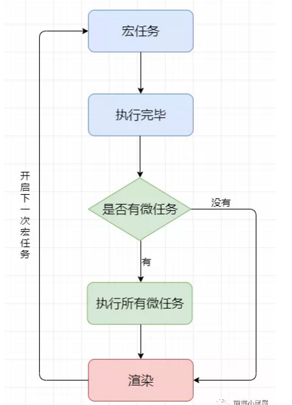

### Event Loop

> js的事件循环机制，真的是太重要了！关于这个我看的东西太多，但是并没有完全理解。尽管这样还是不能阻挡我攻克它的脚步。

> js是单线程执行的，那么单线程如何实现异步操作呢？

#### CPU

cpu是计算机运行的心脏，其实更应该比喻成大脑，因为它是**调度中心**。不过心脏和大脑的重要性都不言而喻。

#### 进程

那么计算机的应用通过怎么的方式运行呢？没错，就是**进程**。进程只是一个概念，是**cpu分配资源的最小单位**。每一个应用都会开启一个进程，用以执行任务。但是单个CPU一次只能运行一个进程，所以各个进程是CPU通过调度算法来交替执行的(*这个操作系统学过，不过已经忘了*)。

#### 线程

在每个进程中，还有线程的概念，是**cpu调度的最小单位**，可以理解成当执行一个任务时，需要多个线程配合才能完成，如有执行计算的线程，有执行渲染的线程。线程共享进程资源。

---

#### 浏览器

首先说明浏览器是**多进程**的，按理说浏览器只是一个应用，怎么会是多进程的呢？这里的多进程指的是通过扩展**子进程**来实现的。另外一个tab页就是一个子进程。那浏览器包含了哪些进程呢？ 

  1. 主进程

     - 协调控制其他子进程(创建、销毁)
     - 浏览器界面显示，用户交互、前进、后退、收藏
     - 将渲染进程得到的内存中的Bitmap，绘制到用户界面上
     - 处理不可见操作、网络请求、文件访问等
  
  2. 第三方插件进程

      - 每种类型的插件对应一个进程，仅当使用使用该插件时才创建
  
  3. GPU进程

      - 用于3D绘制等

  4. 渲染进程(**前端们的领域**)

      - 负责页面渲染，脚本执行，事件处理等
      - 每个tab页面一个渲染进程

##### 渲染进程

> 渲染进程是浏览器的内核，是前端应该专注的地方。那么它包含哪些线程呢？

1. GUI渲染线程

   - 负责渲染页面、布局和绘制
   - 页面需要重绘和回流时，该线程就会执行
   - 与js引擎线程互斥，防止渲染结果不可预期

2. JS引擎线程

   - 负责处理解析和执行js脚本程序
   - 只有一个js引擎线程(**单线程**)
   - 与GUI渲染线程互斥，防止渲染结果不可预期

3. 事件触发线程

    - 用来控制事件循环(各种异步事件)
    - 当执行队列为空时，将事件回调放入到js引擎所在的执行队列中

4. 定时触发器线程

    - `setInterval`与`setTimeout`所在的线程
    - 定时任务并不是由js引擎计时的，是由定时触发线程来计时的
    - 计时完毕后，通知事件触发线程

5. 异步http请求线程

    - 用于处理ajax请求
    - 请求完成时，若有回调函数，通知事件触发线程

##### js运行机制

> js代码编译后是如何运行的呢？通过什么机制来运行呢？

1. 大概流程如下：
   - js会将任务分为**同步任务和异步任务**
   - 同步任务在**执行栈**中供js引擎线程上执行
   - 事件触发线程管理一个**任务队列**，当异步任务触发条件达成时，将**回调函数**放到任务队列中
   - 当执行栈中所有同步任务执行完毕，js引擎线程空闲，就会将任务队列中的回调函数添加到执行栈中执行

首先明确：**对于setTimeout/setInterval等类似函数来说不是异步的，而是其中的回调函数是异步的**

2. 以`setTimeout/setInterval`为例

    - 当执行到它们的时候，**js引擎线程**会通知**定时触发器线程**开始计时，并注册回调函数，当满足设置的时间条件时，**定时触发器线程**将回调函数放入**任务队列**中

3. 以`XHR/fetch`为例

    - 当执行网络请求时，**js引擎线程**会通知**异步http请求线程**，发送一个网络请求，并注册回调函数，当请求完成时，**异步http请求线程**将回调函数放入**任务队列**中

上述流程循环往复，依据此就形成了一个概念：**Event Loop**

##### 宏任务、微任务

> 除了把js任务分为同步任务和异步任务，还可以分为宏任务和微任务

1. 什么是宏任务？

   执行栈中每个任务都是宏任务(包括从事件队列中取出的回调函数)。每个宏任务会连续执行，不会执行其他。

   js引擎线程和GUI线程是互斥的，但是其中有一个规则：**在一个宏任务执行完毕后，在下一个宏任务开始前，GUI渲染线程对页面进行渲染**   
   宏任务 ---> 渲染 ---> 宏任务 ---> ...   

   主代码块，`setTimeout`，`setInterval`等，都属于宏任务

2. 什么是微任务？

    在当前宏任务执行后立即执行的任务，即当宏任务执行完，在渲染前或在下一个宏任务前，将执行期间产生的所有微任务(**微任务队列**)都执行完   

    `Promise.then`，`process.nextTick`等，属于微任务。

### 补充

> js的执行和运行是不同的，执行要分环境，如浏览器环境，node环境等。运行就是js引擎对js代码的解析。node环境中的Event Loop见[node event loop](https://mp.weixin.qq.com/s/cOMlH-z5noHrg6Upg6zyNw)；另一篇参考文章[一次弄懂EventLoop](https://juejin.im/post/5c3d8956e51d4511dc72c200?utm_source=gold_browser_extension#comment)

#### 宏任务(Macro Task)和微任务(MicroTask)

1. 宏任务还包括：`I/O`、`UI Rendering`

2. 微任务包括：`Process.nextTick`、`Promise.then catch finally`(注意我不是说`Promise`)、`MutationObserver`。除了微任务就是宏任务了

3. 在一次event loop中，**微任务的执行优先级比宏任务的高**，微任务中`process.nextTick`比`promise.then`的优先级高
