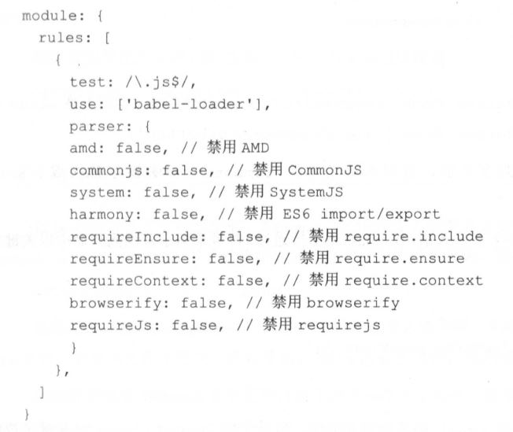

#### module

> module是用来配置模块(其实就是一个文件)的处理规则

##### 配置Loader

rules配置模块的读取和解析规则，通常用来配置Loader(就是用哪个库来处理对应的文件)rules是**一个数组**，配置一项rules大致分为三个步骤：

   1. **条件匹配**：通过`test`、`include`、`exclude`来选中Loader要应用规则的文件。一般来说上述的三个选项都是**字符串或者正则**，但是它们**也支持数组类型**。数组里每项之间是**或**的关系，也就是满足其中的任一条件就行了。

   2. **应用规则**：对选中的文件通过`use`配置项来应用Loader，use是**一个数组**。当应用多个Loader，执行顺序是**从后往前**。可以**给Loader传入参数**，使用`?`后跟参数即可，**当需要传入很多参数时，可以通过一个Object来描述**。

   3. **重置顺序**：一组Loader的执行顺序默认是从后往前执行的，不过可以使用`enforce`选项将其中一个Loader的执行顺序放到**最前**(`enforce: 'pre'`)或者**最后**(`enforce: 'post'`)

##### noParse

1. `noParse`的作用是使webpack去忽略没有使用模块化js文件的解析，这样做可以提高性能。`noParse`是一个可配置项，类型有**RegExp**、**[RegExp]**、**function**三种

2. 需要注意的是：被忽略的文件中不应该有`import`、`require`、`define`等模块化语句，不然就会导致不能再浏览器中运行

##### parser

1. `parser`属性可以更加细粒度地配置哪些模块语法被解析，哪些不被解析。`parser`可以精确到语法层面，它是一个对象。

#### Resolve

> Wevpack会从配置的入口文件中找出所有的依赖模块，其实Webpack中就内置了JavaScript模块化语法解析功能，默认会采用标准里约定的规则去寻找，所以Resolve的意义在于使这一过程可自定义配置。**Resolve是一个对象**

##### alias

resolve.alias配置项用来配置原导入路径的别名，这样的话更加方便。Resolve.alias是**一个对象**。例如：  

      resolve: {
         alias: {
            components: './src/components/'
         }
      }
很明显引用时简单多了。   
还支持通过\$符号来缩小范围，只命中一关键字结尾的导入语句，例如:   

      resolve: {
         alias: {
            'react$': '/path/to/react.min.js'
         }
      }
这时只能命中以react结尾的导入语句

##### mainFields

有一些第三方模块会针对不同的环境提供几份的代码，这时就要判断需要加载哪个文件了。`mainFields`就是决定去加载哪份代码的，**值为数组**，默认值是`mainFields: ['browser','main']`。`mainFields`会按照在数组里的顺序在`package.json`文件中去加载，只会使用找到的第一个文件

##### extensions

在导入文件没有后缀时，通过`extensions`去指定可加载的后缀，**值为数组**。默认值是`extensions: ['.js','.json']`

##### modules

配置webpack去哪些目录下寻找第三方模块，默认只会在`node_modules`目录下去寻找。但是一些模块会被其他模块大量引用，但是这些模块的位置不确定，这时就要使用相对路径了，这会造成引用路径过长的情况，**值为数组**。例如：被大量导入的模块位于`'./src/components'`,则设置`modules: ['./src/components','node_modules']`后，可以使用`import 'button'`导入

##### descriptionFiles

配置第三方模块的文件名称，就是`package.json`文件，**值为数组**，默认值为`descriptionFiles: ['package.json']`

##### enforceExtension

**值为Boolean**，为`true`时，导入的文件必须带后缀

##### enforceModuleExtension

与`enforceExtension`作用类似，但是只针对`node_modules`里的文件起作用